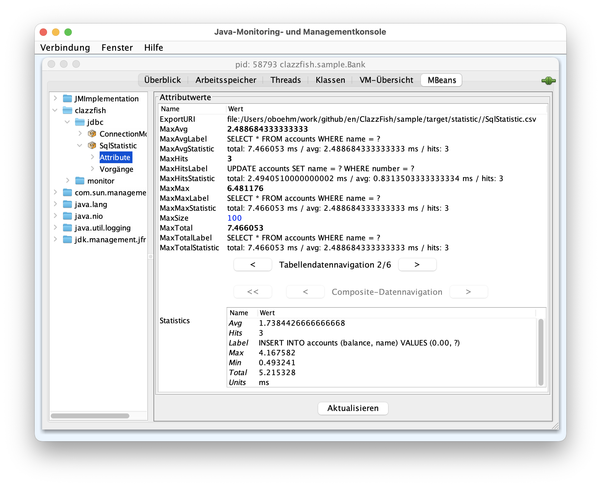

= SQL Logging and Monitoring

ClazzFish provides a
link:../../jdbc/src/main/java/clazzfish/jdbc/ProxyDriver.java[ProxyDriver]
which can be registered as JDBC driver.
It uses "`jdbx:proxy:...`" as prefix and will forward the JDBC calls to the normal driver (registered as "`jdbc:...`").

== Dependencies

To add the SQL features of ClazzFish to your project use the following dependecies for Maven:

.Maven Dependencies
[source,xml]
----
<dependency>
  <groupId>de.aosd.clazzfish</groupId>
  <artifactId>clazzfish-jdbc</artifactId>
  <version>3.0</version>
</dependency>
----

For the actual version see e.g. https://search.maven.org/search?q=clazzfish-jdbc[search.maven.org].

If you start your application and sees the message "`SLF4J: Failed to load class "org.slf4j.impl.StaticLoggerBinder"`" in your log
a dependency for SLF4J (Simple Log Facade for Java) is missing:

.SLF4J Dependencies
[source,xml]
----
<dependency>
    <groupId>org.slf4j</groupId>
    <artifactId>slf4j-log4j12</artifactId>
    <version>2.0.17</version>
</dependency>
----

Add this to your maven dependencies.

== Driver Registration

.Driver Properties for HSQL-DB
|===
|Property |Value | Description

|driver name
|clazzfish.jdbc.ProxyDriver
|driver class

|driver url
|jdbc:proxy:hsqldb:mem:testdb
|JDBC-URL for HSQL-DB (jdbc:proxy:hsqldb:mem:testdb)

|===

For other database change the URL - put "`proxy:`" after the first part ("`jdbc:...`").

Don't forget to register the driver to JDBC:

.Example for Driver Registration
[source,java]
----
private static void loadDbDriver() throws ClassNotFoundException {
    Class.forName("clazzfish.jdbc.ProxyDriver");
    Class.forName("org.hsqldb.jdbcDriver");
}
----

Because the ProxyDriver of ClazzFish forwards the call to the original driver you have to register it also.
Some drivers will be automatically registered by ClassFish but only these which are known by it.
For v2.2 the known JDBC drivers are:

* HSQL-DB
* MS SQL-Server
* JTurbo
* Informix
* PostgreSQL

Other JDBC drivers must be registered manually (as in the example above).

== Logging

=== Log4J

If you want to use Log4J add `org.apache.logging.log4j:log4j-slf4j2-impl` to your dependencies.
In Maven this looks like

.pom.xml
[source,xml]
----
<dependency>
    <groupId>org.apache.logging.log4j</groupId>
    <artifactId>log4j-slf4j2-impl</artifactId>
</dependency>
----

To log the SQL statements set the log level for `clazzfish.jdbc.SqlStatistic` to `DEBUG`:

.Logger Configuration
[source,xml]
----
<Logger name="clazzfish.jdbc.SqlStatistic" level="debug"/>
----

Add this entry to your Loggers configuration in your Log4J-2 configuration file (usually `log4j2.xml`).

[example log]
....
07:31:56 DEBUG [main|clazzfish.jdbc.SqlStatistic] "CREATE TABLE accounts (number INTEGER IDENTITY PRIMARY KEY, balance DECIMAL(10,2), name VARCHAR(50))" returned with 0 after 1 ms.
07:31:56 DEBUG [main|clazzfish.jdbc.SqlStatistic] "SELECT * FROM accounts WHERE name = 'Tom'" returned with open JDBCResultSet after 32 ms.
07:31:56  INFO [main|sample.jdbc.BankRepository ] 0 account(s) found for Tom.
07:31:56 DEBUG [main|clazzfish.jdbc.SqlStatistic] "INSERT INTO accounts (balance, name) VALUES (0.00, 'nobody')" returned with 1 after 0 ms.
07:31:56 DEBUG [main|clazzfish.jdbc.SqlStatistic] "SELECT * FROM accounts WHERE name = 'nobody'" returned with open JDBCResultSet after 0 ms.
07:31:56  INFO [main|sample.jdbc.BankRepository ] 1 account(s) found for nobody.
07:31:56 DEBUG [main|clazzfish.jdbc.SqlStatistic] "UPDATE accounts SET name = 'Tom' WHERE number = 0" returned with 1 after 4 ms.
07:31:56 DEBUG [main|clazzfish.jdbc.SqlStatistic] "SELECT balance, name FROM accounts where number = 0" returned with true after 0 ms.
07:31:56 DEBUG [main|clazzfish.jdbc.SqlStatistic] "SELECT * FROM accounts WHERE name = 'Jim'" returned with open JDBCResultSet after 0 ms.
07:31:56  INFO [main|sample.jdbc.BankRepository ] 0 account(s) found for Jim.
....

This is the output of the log you can see if you start the unit test
link:../../sample/src/test/java/clazzfish/sample/jdbc/BankRepositoryTest.java[BankRepositoryTest]
with link:../../sample/src/main/resources/log4j2.xml[log4j2.xml] as LOG4J configuration
in link:../../sample[clazzfish-sample].

=== Other Logging Frameworks

Logging is based on SLF4J.
So if you want to use other logging frameworks see the https://sematext.com/blog/slf4j-tutorial/[SLF4J Tutorial].

== Tracing

The logging with stacktrace is available only in TRACE level.
To activate it add the following line to your Log4J configuration:

.Logger Configuration
[source,xml]
----
<Logger name="clazzfish.jdbc.SqlStatistic" level="trace"/>
----

With this configruration you see

[example log]
....
07:42:00 TRACE [main|clazzfish.jdbc.SqlStatistic] "CREATE TABLE accounts (number INTEGER IDENTITY PRIMARY KEY, balance DECIMAL(10,2), name VARCHAR(50))" returned with 0 after 2 ms
	at clazzfish.sample.jdbc.BankRepository.executeUpdate(BankRepository.java:87)
	at clazzfish.sample.jdbc.BankRepository.setUpDB(BankRepository.java:68)
	at clazzfish.sample.jdbc.BankRepositoryTest.setUpRepository(BankRepositoryTest.java:46)
	...
07:42:00 TRACE [main|clazzfish.jdbc.SqlStatistic] "SELECT * FROM accounts WHERE name = 'Tom'" returned with open JDBCResultSet after 9 ms
	at clazzfish.sample.jdbc.BankRepository.getAccountsFor(BankRepository.java:139)
	at clazzfish.sample.jdbc.BankRepositoryTest.getAccountFor(BankRepositoryTest.java:56)
	at clazzfish.sample.jdbc.BankRepositoryTest.setUpRepository(BankRepositoryTest.java:47)
	...
07:42:00  INFO [main|sample.jdbc.BankRepository ] 0 account(s) found for Tom.
07:42:00 TRACE [main|clazzfish.jdbc.SqlStatistic] "INSERT INTO accounts (balance, name) VALUES (0.00, 'nobody')" returned with 1 after 1 ms
	at clazzfish.sample.jdbc.BankRepository.createAccount(BankRepository.java:183)
	at clazzfish.sample.jdbc.BankRepository.createAccountFor(BankRepository.java:160)
	at clazzfish.sample.jdbc.BankRepositoryTest.getAccountFor(BankRepositoryTest.java:58)
	at clazzfish.sample.jdbc.BankRepositoryTest.setUpRepository(BankRepositoryTest.java:47)
	...
....

in the log.

== Monitoring

You have different JMX-Beans which allows you to have a look on different states and statistics of your application:

* clazzfish.jdbc.ConnectionMonitor: shows you, which connections are open
* clazzfish.jdbc.SqlStatistic: shows you the execution time of the different SQL statements

With the Statistics attribute you can walk thru the different SQL statements to see

* Label: the SQL statement itself
* Hits: how often the SQL statement was called
* Avg: the average execution time
* Max: the maximal execution time
* Min: the minimal execution time
* Total: the sum of the execution time

The units of the execution is measured in milliseconds (ms).
The number of different SQL statements which are stored is 100.
If you want more set the attribute `MaxSize` to a higher value.

=== Optimization

To optimize your SQL statements take a look at the following attributes:

* prefix `MaxAvg`: describes the SQL statement with the highest average execution time
* prefix `MaxHits`: the SQL statements with the higest number of calls
* prefix `MaxMax`: the maximal execution time of a SQL statement
* prefix `MaxTotal`: the maximal total time of all SQL statments

=== Dumping and Recording

There is a `JdbcStarter` class which allows you to create a CSV-File 'SqlStatstitic.csv' with the statistic dates of the SQL statements:

[source,java]
----
static {
    URI statDir = new File("target", "statistic").toURI();
    JdbcStarter.recordAll(statDir);
}
----

At the end of you application a file 'SqlStatistic.csv' is created at the given directory ('target/statistic').
If the file exists from the last call the dates are imported before.

[%autowidth]
|===
|Label |Unit |Total |Avg |Hits |Max |Min

|"SELECT * FROM accounts WHERE name = ?"| ms| 7.466053| 2.488684333333333| 3| 6.481176| 0.456471

|"INSERT INTO accounts (balance, name) VALUES (0.00, ?)"| ms| 5.215328| 1.7384426666666668| 3| 4.167582| 0.493241

|"UPDATE accounts SET name = ? WHERE number = ?"| ms| 2.4940510000000002| 0.8313503333333334| 3| 1.605394| 0.395452

|"SELECT * FROM accounts"| ms| 1.263792| 0.631896| 2| 0.677539| 0.586253

|"SELECT balance, name FROM accounts where number = ?"| ms| 0.8120809999999999| 0.27069366666666667| 3| 0.342806| 0.229994

|"CREATE TABLE accounts (number INTEGER IDENTITY PRIMARY KEY, balance DECIMAL(10,2), name VARCHAR(50))"| ms| 0.489595| 0.489595| 1| 0.489595| 0.489595
|===

The exported table is sorted after the total execution time of the SQL statement.
